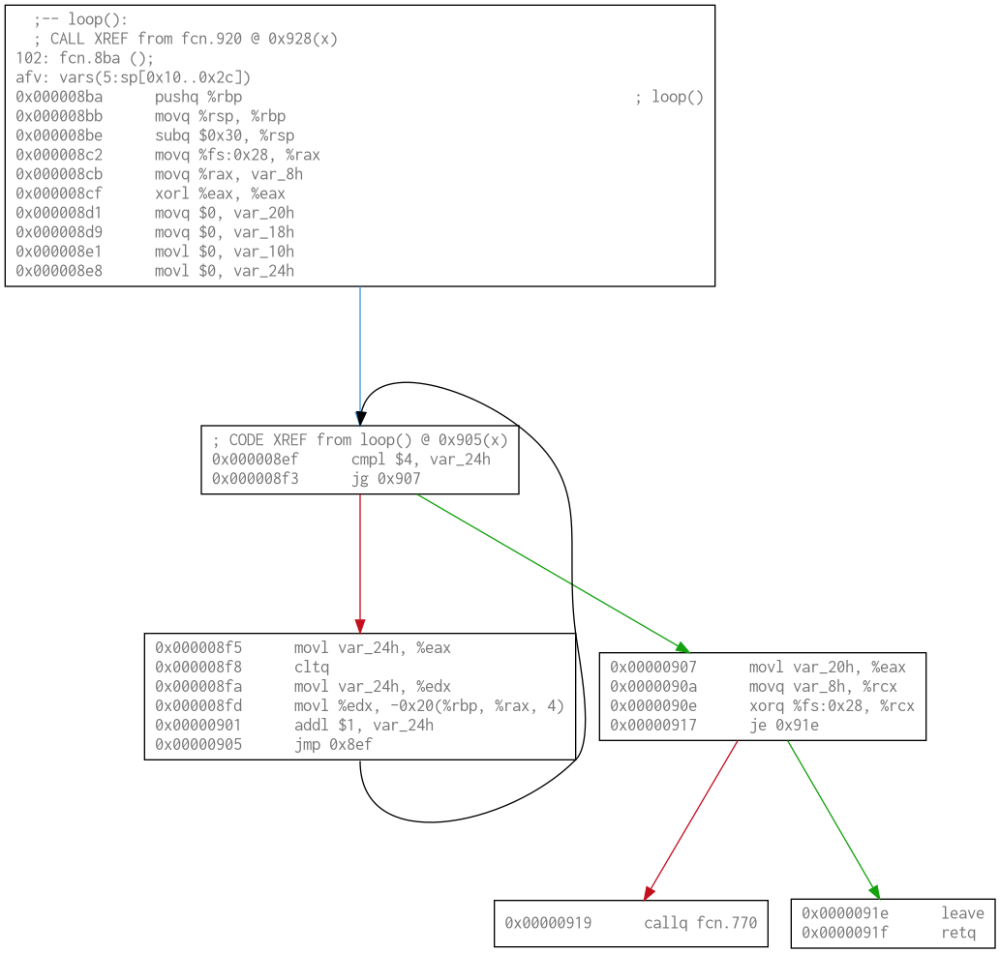

# cfg-visualizer
Control flow graph visualizer with Python API using radare2 developed for [UCSD CSE 142L](https://github.com/CSE142/Home/tree/master).

Example assignment [here](https://github.com/CSE142/fa21-CSE142L-compiler-starter/blob/main/Lab.pdf).

## Environment setup

Follow instructions on how to install radare2 [here](https://rada.re/n/radare2.html). 

`environment.yml` provides a conda environment with all dependencies. Install by running:
```
conda env create -f environment.yml
```

## Example CFG
An example with a small loop. Green edges indicate the "taken" branch and red edges indicate the "not taken" branch.

Given this example code
```c++
// From example/test.cpp
int loop() {
	int i;
	int arr[5] = {};

	for (i = 0; i < 5; i++) {
		arr[i] = i;
	}
	return arr[0];
}
```
Run
```
python3 cfg.py ./example/test -o loop.png --spacing=1.5 --symbol loop__
```

to produce


